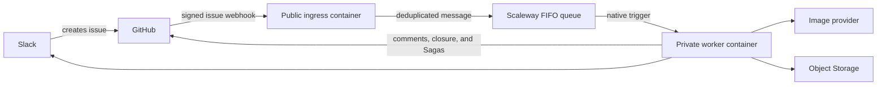

# Hosted meme processing

Meme requests use one processing path:



There is no GitHub Actions request processor, backend selector, canary routing,
or diagnostic runtime mode. If the hosted service needs maintenance, pause the
Slack workflow that creates issues, repair or deploy the service, and resume
intake.

> [!IMPORTANT]
> When upgrading an existing deployment to this hosted-only version, merge and
> deploy both new runtime images before applying the OpenTofu changes. The old
> binaries interpret missing mode variables as disabled or diagnostic. Pause
> Slack intake, wait for both deployment workflows to succeed, apply OpenTofu,
> verify ingress and worker health, and then resume intake. Remove obsolete
> `deploy_containers`, `worker_trigger_enabled`, `hosted_ingress_mode`,
> `hosted_canary_label`, `worker_mode`, `worker_diagnostic_response`, and
> `worker_privacy` entries from existing variable files.

## Runtime behavior

The ingress:

- verifies `X-Hub-Signature-256`;
- accepts `opened` and `reopened` issue events;
- validates the issue body and repository identity;
- publishes one FIFO message per `X-GitHub-Delivery`;
- returns `202` after the queue accepts the message.

The worker:

- validates the queue envelope and target repository;
- parses the Slack fields and Saga directives from the issue body;
- generates an image or performs a write-only Saga update;
- publishes images under `memes/<memeId>.jpg` using the Standard One Zone
  (`ONEZONE_IA`) Object Storage class;
- updates GitHub and Slack;
- returns `503` for retryable infrastructure and delivery failures;
- acknowledges malformed messages and terminal generation failures with `200`.

The request queue retains messages for 24 hours, uses a 240-second visibility
timeout, and moves a message to the DLQ after four receives. Pause Slack intake
before maintenance expected to exceed the retention period.

### Idempotency

The repository, issue number, and GitHub delivery ID form the durable request
identity. The worker derives a stable meme UUID from that identity.

- An existing image object is the success receipt.
- Images use conditional writes, so concurrent attempts converge on one object.
- Terminal generation failures use a private conditional
  `terminal-outcomes/<memeId>.json` receipt in the same One Zone class.
- Saga writes atomically commit `context/<saga>.md` and a minimal receipt under
  `.github/meme-worker/saga-folds/`.
- Issue completion comments carry a hidden delivery marker.

A crash after a provider accepts a request but before Object Storage accepts
the image can repeat a billed provider call. Slack webhooks can also duplicate
a notification if Slack accepts it immediately before another delivery branch
fails.

## Configuration

### Ingress

| Variable                | Purpose                        |
| ----------------------- | ------------------------------ |
| `GITHUB_WEBHOOK_SECRET` | GitHub webhook signing secret  |
| `SQS_ACCESS_KEY`        | Publish-only queue credential  |
| `SQS_SECRET_KEY`        | Queue credential secret        |
| `SQS_ENDPOINT`          | Regional Scaleway SQS endpoint |
| `SQS_QUEUE_URL`         | FIFO request queue URL         |
| `SQS_REGION`            | Queue region                   |
| `PORT`                  | HTTP port; defaults to `8080`  |

### Worker

| Variable                         | Purpose                                                    |
| -------------------------------- | ---------------------------------------------------------- |
| `GITHUB_FINE_GRAINED_PAT`        | Repository token with Contents and Issues read/write       |
| `GITHUB_REPOSITORY`              | Repository the worker may mutate                           |
| `GITHUB_TARGET_BRANCH`           | Saga target branch; defaults to `main`                     |
| `GITHUB_API_URL`                 | GitHub REST base URL; defaults to `https://api.github.com` |
| `SLACK_WEBHOOK_URL`              | Slack incoming webhook                                     |
| `OPENAI_API_KEY`                 | Primary image generation and Saga compression              |
| `XAI_API_KEY`                    | Optional moderation fallback                               |
| `OBJECT_STORAGE_ENDPOINT`        | Regional S3-compatible endpoint                            |
| `OBJECT_STORAGE_REGION`          | Object Storage signing region                              |
| `OBJECT_STORAGE_BUCKET`          | Image and terminal-outcome bucket                          |
| `OBJECT_STORAGE_PUBLIC_BASE_URL` | Public URL used in notifications                           |
| `OBJECT_STORAGE_ACCESS_KEY`      | Worker Object Storage credential                           |
| `OBJECT_STORAGE_SECRET_KEY`      | Worker Object Storage credential secret                    |
| `PORT`                           | HTTP port; defaults to `8080`                              |

## Initial provisioning

Copy `infra/scaleway/terraform.tfvars.example` to an ignored
`infra/scaleway/terraform.tfvars` or provide the same values through
`TF_VAR_*`. Supply the sensitive variables without committing them:

- `github_webhook_secret`
- `github_fine_grained_pat`
- `openai_api_key`
- `slack_webhook_url`
- optional `xai_api_key`

### Loading a secret manager's mounted env file

Secret managers can expose an env file as a named pipe rather than a regular
file, so the values never touch the disk. Bash's `source` builtin cannot read
one: it needs a seekable file, and it fails **silently**, leaving every variable
empty rather than erroring. Most variables are required and would fail the
apply, but `xai_api_key` is optional, so an apply from a silently-empty
environment removes `XAI_API_KEY` from the worker and disables the moderation
fallback.

Read the file with a command instead, so the load fails loudly if it fails:

```bash
set -a
while IFS= read -r line; do
  [ -z "$line" ] && continue
  case "$line" in \#*) continue ;; *=*) export "${line%%=*}=${line#*=}" ;; esac
done < <(cat .env.scaleway)
set +a
```

Check `TF_VAR_project_id` is non-empty before running `apply`.

The container images must exist before Scaleway can create the containers.
Bootstrap the registry first, push both images, and then apply the complete
configuration:

```bash
tofu -chdir=infra/scaleway init
tofu -chdir=infra/scaleway apply -target=scaleway_registry_namespace.main

registry="$(tofu -chdir=infra/scaleway output -raw registry_endpoint)"
registry_host="${registry%%/*}"
tag="$(git rev-parse HEAD)"

printf '%s' "$SCW_SECRET_KEY" |
  docker login "$registry_host" --username nologin --password-stdin
docker build --platform linux/amd64 \
  --file infra/scaleway/images/ingress.Dockerfile \
  --tag "${registry}/webhook:${tag}" .
docker build --platform linux/amd64 \
  --file infra/scaleway/images/worker.Dockerfile \
  --tag "${registry}/worker:${tag}" .
docker push "${registry}/webhook:${tag}"
docker push "${registry}/worker:${tag}"

TF_VAR_image_tag="$tag" tofu -chdir=infra/scaleway apply
```

Create a GitHub webhook pointing to
`$(tofu -chdir=infra/scaleway output -raw ingress_endpoint)/webhooks/github`.
Use JSON content, the configured signing secret, and only Issue events.

OpenTofu creates the registry, queues, DLQ, scoped queue credentials, Object
Storage bucket and policy, worker storage identity, both containers, and the
worker trigger. It keeps the worker private and both containers at zero minimum
instances.

OpenTofu state lives in Scaleway Object Storage (see `infra/scaleway/backend.tf`)
so that CI can plan and apply it. State contains the rotating worker Object
Storage key in plaintext, so the state bucket must stay private and versioned,
and must not be the public images bucket. Secret variable files remain local:
keep them untracked, mode `0600`, and back them up only to encrypted storage.
Saved plan files contain secret values and must not be committed.

### Creating the state bucket

The bucket cannot be managed by the configuration it stores, so create it once
out of band before the first `init`:

```bash
scw object bucket create name=memes-<project-id>-tfstate region=nl-ams
scw object bucket update name=memes-<project-id>-tfstate region=nl-ams \
  versioning.enabled=true
```

Migrate existing local state into it with:

```bash
tofu -chdir=infra/scaleway init -migrate-state
```

Once that reports success, delete the local `terraform.tfstate` and
`terraform.tfstate.backup` files so nothing can apply from a stale copy.

State locking uses S3 conditional writes and is verified working against
Scaleway: `init`, `plan`, and `apply` all report acquiring and releasing the
lock.

### Applying from a workstation may fail on filtered networks

The Scaleway provider addresses buckets as `<bucket>.s3.<region>.scw.cloud`,
and that is not configurable the way the backend is. DNS filters that
categorize the public images bucket resolve that hostname to a block address,
so `plan` and `apply` fail with a TLS handshake error on `GetBucketCors` even
though the bucket is healthy and the same call succeeds elsewhere. The backend
itself is unaffected because it is pinned to path style.

If that happens, apply from CI rather than working around it locally; the
runner is not subject to the filter.

## Infrastructure deployment

Application deployment and infrastructure deployment are separate paths.
`deploy-ingress.yml` and `deploy-worker.yml` only watch the Dockerfiles and only
call `scw container container update`, so they never run OpenTofu. Changes under
`infra/scaleway` are applied by:

- `.github/workflows/infra-apply.yml` on merges to `main` that touch `*.tf`, and
  on demand. It runs against the approval-gated `production` environment.
- `.github/workflows/infra-drift.yml` on a daily schedule. It runs a read-only
  plan against the `infra-drift` environment and fails if production no longer
  matches the committed configuration. It deliberately does not open an issue,
  because an issue in this repository is a meme request.
- Both call `.github/workflows/infra-tofu.yml`.

Add required reviewers to the `production` environment. Its Scaleway key must be
able to write IAM policies, because the configuration manages
`scaleway_iam_application`, `scaleway_iam_policy`, and `scaleway_iam_api_key`.
A key that can write IAM policies can grant itself anything, so it cannot be
scoped down further and the approval gate is what actually constrains it.

Create a second `infra-drift` environment with no reviewers, holding a Scaleway
key with read-only access to the project and the state bucket. The scheduled
plan passes `-lock=false` so it never needs to write.

These repository-level values are shared by both environments:

| Name                                                  | Kind     | Purpose                                                                            |
| ----------------------------------------------------- | -------- | ---------------------------------------------------------------------------------- |
| `SCW_PROJECT_ID`, `SCW_REGION`, `SCW_ORGANIZATION_ID` | Variable | Also set per environment; hoist to repository level so `infra-drift` inherits them |
| `SCW_TOFU_PRINCIPAL`                                  | Variable | `object_storage_provisioning_principal`                                            |
| `TOFU_GITHUB_WEBHOOK_SECRET`                          | Secret   | `github_webhook_secret`                                                            |
| `TOFU_GITHUB_FINE_GRAINED_PAT`                        | Secret   | `github_fine_grained_pat`                                                          |
| `TOFU_SLACK_WEBHOOK_URL`                              | Secret   | `slack_webhook_url`                                                                |
| `TOFU_OPENAI_API_KEY`                                 | Secret   | `openai_api_key`                                                                   |
| `TOFU_XAI_API_KEY`                                    | Secret   | `xai_api_key`                                                                      |

Four of those five secrets are guarded by `precondition` blocks that fail the
apply if they are missing. `xai_api_key` is not: a missing value drops
`XAI_API_KEY` from the worker instead of failing, so `infra-tofu.yml` checks for
it explicitly before running.

Container images are not affected by an apply. Both containers declare
`lifecycle { ignore_changes = [image, registry_sha256] }`, so the currently
deployed images survive an apply that carries a different `image_tag`.

## Application deployment

Merges to `main` deploy changed runtimes:

- `.github/workflows/deploy-ingress.yml` builds and deploys ingress changes.
- `.github/workflows/deploy-worker.yml` builds and deploys worker or shared
  processing changes.
- Both call `.github/workflows/deploy-runtime.yml`.

The `production` GitHub Environment provides:

| Variable                   | Purpose                     |
| -------------------------- | --------------------------- |
| `SCW_PROJECT_ID`           | Scaleway project            |
| `SCW_ORGANIZATION_ID`      | Scaleway organization       |
| `SCW_REGION`               | Runtime region              |
| `SCW_REGISTRY_HOST`        | Registry login host         |
| `SCW_REGISTRY_ENDPOINT`    | Registry namespace endpoint |
| `SCW_INGRESS_CONTAINER_ID` | Ingress container ID        |
| `SCW_WORKER_CONTAINER_ID`  | Worker container ID         |
| `PRODUCTION_URL`           | Public ingress URL          |

It also contains `SCW_ACCESS_KEY` and `SCW_SECRET_KEY` as secrets. Runtime
secrets stay in Scaleway.

Populate the container IDs and production URL after the initial apply:

```bash
tofu -chdir=infra/scaleway output -raw ingress_container_id
tofu -chdir=infra/scaleway output -raw worker_container_id
tofu -chdir=infra/scaleway output -raw ingress_endpoint
```

The deployment script updates one image, waits for Scaleway readiness, verifies
the selected image, and restores the previous image on failure. Ingress also
receives an HTTP health check.

## Operations

- Probe ingress with `curl -fsS "$INGRESS_ENDPOINT/health"`.
- Monitor visible, in-flight, oldest, and DLQ message counts.
- Treat any DLQ message as requiring inspection.
- Run the Apply infrastructure workflow at least monthly so the rotating worker
  Object Storage key advances before expiry. Monitor the
  `worker_object_storage_key_rotation_at` and
  `worker_object_storage_key_expires_at` outputs.
- Treat a failing drift detection run as an incident: production and the
  repository disagree, so the next merge to `main` will revert whatever changed
  out of band.
- Pause Slack intake before changing runtime secrets or repairing
  infrastructure. Resume it after ingress and worker are healthy.
- Alert on `Rejecting queue delivery` worker log entries. They indicate a
  malformed envelope, an unexpected repository, or an invalid Slack issue body
  that was acknowledged without retry.

After this version is deployed, delete the unused `MEME_PROCESSING_BACKEND`
repository variable, the `hosted-canary` label, and the old request-processing
`OPENAI_API_KEY`, `XAI_API_KEY`, and `SLACK_WEBHOOK_URL` GitHub Actions secrets.
Do not remove deployment credentials used by the `production` Environment.

To inspect or replay the DLQ, load the sensitive operations credentials only
into the current shell:

```bash
cd infra/scaleway
export AWS_ACCESS_KEY_ID="$(tofu output -raw operations_sqs_access_key)"
export AWS_SECRET_ACCESS_KEY="$(tofu output -raw operations_sqs_secret_key)"
export AWS_DEFAULT_REGION=nl-ams
endpoint="$(tofu output -raw sqs_endpoint)"
dlq="$(tofu output -raw dead_letter_queue_url)"
request_queue="$(tofu output -raw request_queue_url)"
```

Inspect and replay one delivery at a time. Delete a DLQ receipt only after the
replacement send succeeds. Never purge a queue without separately recording
the affected delivery IDs.
