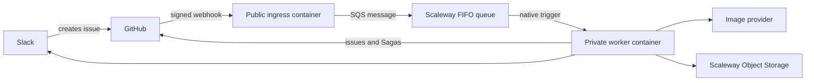

# Hosted webhook architecture

## Recommendation

Use **Scaleway Serverless Containers with Scaleway Queues** in an EU region.

Scaleway Containers scale to zero and accept OCI images. Scaleway Queues is an
in-house, managed implementation of the SQS protocol and does not depend on AWS
infrastructure. It provides Standard and FIFO queues, visibility timeouts,
message retention, explicit or content-based deduplication, and dead-letter
queues.

This repository uses the AWS JavaScript SQS client because that is the Node.js
client documented by Scaleway. It connects directly to Scaleway's endpoint with
Scaleway credentials; no AWS account or service is involved.

Sources:

- [Scaleway Queues FAQ](https://www.scaleway.com/en/docs/queues/faq/)
- [Using Node.js with Scaleway Queues](https://www.scaleway.com/en/docs/queues/api-cli/python-node-queues/)
- [Scaleway Queues concepts](https://www.scaleway.com/en/docs/queues/concepts/)
- [Deploying a Serverless Container](https://www.scaleway.com/en/docs/serverless-containers/how-to/deploy-container/)
- [Object Storage concepts and regional endpoints](https://www.scaleway.com/en/docs/object-storage/concepts/#endpoint)
- [Conditional object writes](https://www.scaleway.com/en/docs/object-storage/api-cli/using-conditional-writes/)
- [Bucket policies](https://www.scaleway.com/en/docs/object-storage/api-cli/bucket-policy/)
- [Combining IAM and bucket policies](https://www.scaleway.com/en/docs/object-storage/api-cli/combining-iam-and-object-storage/)
- [IAM permission sets](https://www.scaleway.com/en/docs/iam/reference-content/permission-sets/)
- [Scaleway CLI API-key lookup](https://cli.scaleway.com/iam/#get-an-api-key)
- [`time_rotating` provider resource](https://registry.terraform.io/providers/hashicorp/time/latest/docs/resources/rotating)

## Target flow



The ingress validates the raw `X-Hub-Signature-256`, accepts only opened or
reopened issue events, publishes one message per `X-GitHub-Delivery`, and
returns `202`. The delivery ID is the FIFO message deduplication ID.
Ingress and worker transport both validate the same strict queue task schema:
non-empty delivery ID and issue body, a positive decimal issue number, and an
`owner/repository` identity.

A native Scaleway queue trigger invokes the worker with the message in the
event body's `body` field. A response status of 300 or greater is retried up to
three times. Processing must finish before the worker responds.

Sources:

- [GitHub webhook best practices](https://docs.github.com/en/webhooks/using-webhooks/best-practices-for-using-webhooks)
- [Adding a trigger to a container](https://www.scaleway.com/en/docs/serverless-containers/how-to/add-trigger-to-a-container/)
- [Queue trigger retention](https://www.scaleway.com/en/docs/serverless-containers/reference-content/configure-trigger-inputs/)

## Current implementation

The repository contains the public ingress slice:

- `src/hosted/ingress/webhook-server.ts` exposes `/health` and
  `/webhooks/github`.
- `src/hosted/ingress/github-webhook.ts` validates and decodes GitHub
  deliveries.
- `src/hosted/ingress/scaleway-queue.ts` publishes deduplicated messages to a
  FIFO queue.
- `infra/scaleway/images/ingress.Dockerfile` builds the ingress container.

The repository also contains the queue worker slice:

- `src/hosted/worker/worker-app.ts` owns the tested HTTP handler and runtime
  composition for `POST /`, `POST /queue`, and `GET /health`;
  `worker-server.ts` is only the executable entry point.
- `src/hosted/worker/worker-transport.ts` tolerates either a direct JSON task or
  an event object whose `body` is the task object or its serialized JSON.
- `src/hosted/worker/worker-app.ts` creates request-scoped configuration, while
  `src/hosted/worker/hosted-worker.ts` directly orchestrates the hosted
  Object Storage, GitHub, and Slack adapters around shared provider, prompt, and
  Saga helpers.
- `src/hosted/worker/hosted-object-storage.ts` publishes immutable JPEGs through
  Scaleway's S3-compatible API and persists private terminal outcomes.
- `src/hosted/worker/hosted-github.ts` uses the Contents API for reads and the
  Git Data API only for atomic Saga canon/receipt writes, issue comments, and
  issue closure.
- `src/hosted/worker/hosted-notifier.ts` posts the existing Slack payload
  contract with the Node HTTP client rather than shelling out to `curl`.
- `infra/scaleway/images/worker.Dockerfile` builds the dedicated production
  worker image.

Malformed envelopes, invalid task identities, and invalid Slack issue bodies
receive a terminal `200` response with `disposition: rejected`. Exhausted
generation outcomes - moderation failure, exhausted quota/providers, exhausted
rate-limit retries, and provider errors - are also terminal: the worker stores a
private conditional outcome object, posts the normal failure notification, and
then returns `200`. Moderation retains the existing `not_planned` close
behavior; other provider failures retain the existing failure comment without
automatically closing the issue. Object Storage, GitHub, Saga persistence, and
Slack I/O failures receive `503`, causing the Scaleway trigger to retry.
Successful and resumed deliveries receive `200`. The CLI and GitHub Actions
layers are unchanged and retain their filesystem, `git`, `gh`, `curl`, and
GitHub raw image URLs.

### Persistence and idempotency

The durable identity is the repository, issue number, and GitHub delivery ID.
The worker derives the same stable meme UUID as before and uses
`memes/<memeId>.jpg` as the Object Storage key.

1. Before calling an image provider, `HeadObject` checks that deterministic key.
   An existing image is the successful-publication receipt and resumes
   notification from its bounded metadata.
2. If no image or terminal outcome exists, read any Saga canon, generate the
   JPEG, and write it with `If-None-Match: *`, `Content-Type: image/jpeg`, and
   immutable cache control. A `412` is a concurrent winner, so the worker reads
   the winning object's metadata and resumes without regenerating.
3. Notify Slack while folding an optional Saga in parallel. Each branch runs to
   completion even if the other fails; after both finish, either failure makes
   the delivery retryable.
4. Saga folding commits `context/<saga>.md` and
   `.github/meme-worker/saga-folds/<sha256>.json` atomically. That receipt
   contains only the delivery ID, Saga name, and `folded: true`. Ref conflicts
   re-read the receipt and latest canon, re-derive, and retry without force.
5. Terminal generation failures use a private conditional
   `terminal-outcomes/<memeId>.json` record. This is necessary because there is
   no successful image object to act as the receipt; it prevents notification
   retries from invoking providers again. Successful images have no sidecar.

No-Saga image deliveries create no Git commit. Read/write and write-only Saga
deliveries create one atomic canon-plus-receipt commit. There are two accepted
crash windows:

- A crash after a provider accepts the request but before the conditional image
  write completes can cause another billed provider call. Neither the current
  providers nor Scaleway supply an end-to-end idempotency key.
- Slack incoming webhooks have no idempotency key or returned message ID. A
  retry after Slack accepts a request but before all processing completes can
  post the notification twice.

Issue completion comments include a hidden delivery marker. Retries find and
update or reuse that comment before idempotently closing the issue.

### Forward-only image cutover

The migration does not move or rewrite historical `memes/*.jpg` files. Their
existing GitHub raw URLs remain permanent. Every newly hosted delivery after
cutover uses Object Storage; no image or general delivery-state JSON is
committed to GitHub. Existing repository history and historical delivery
commits remain untouched.

> [!IMPORTANT]
> Do not merge the Object Storage migration before pre-provisioning its
> resources and all six required `OBJECT_STORAGE_*` worker variables from the
> migration branch. Merging changes under `src/hosted/worker/**` automatically
> deploys the new worker image. The worker deployment verifies the selected
> image but has no HTTP health gate, so missing runtime configuration will not
> trigger a functional rollback.

Use this order for an existing hosted deployment:

1. Check out the migration branch while GitHub Actions remains authoritative.
2. Load the existing `.env.scaleway`, set
   `TF_VAR_object_storage_provisioning_principal` to the `user_id:<uuid>` or
   `application_id:<uuid>` that owns `SCW_ACCESS_KEY`, preserve the currently
   applied ingress, worker, and trigger modes, and run OpenTofu from this branch.
3. Review and apply a plan that creates the bucket, private ACL, bucket policy,
   IAM application/policy, and API key and updates the existing worker
   container with all six `OBJECT_STORAGE_*` values. Keep
   `deploy_containers=true`. The worker resource's lifecycle rule ignores
   `image` and `registry_sha256`, so this apply must leave the old worker image
   running.
4. Verify the worker image reference is unchanged, the existing worker remains
   healthy, and the new bucket/policy/application outputs exist. Do not merge
   if the current worker regresses.
5. Merge the migration. Only now may `deploy-worker.yml` replace the old image
   with the Object Storage-aware image.
6. Confirm the worker deployment completes, verify worker health/logs, and run
   the exclusive live canary before transferring processing authority.

When the setup wizard detects existing containers, its durable-services stage
uses a one-time targeted plan for only the new bucket, bucket policy, IAM
application/policy, rotating clock, and API key so `deploy_containers=false`
cannot remove the running services. It derives the provisioning principal from
the active Scaleway API key when possible and otherwise asks for it. Continue to
the inert-container apply to wire the six worker values while retaining the old
image, then stop before live-canary stages until the migration has merged and
the worker deployment has completed.

#### Recovering a partially applied Object Storage migration

If the bucket policy already exists without the provisioning-principal
statement, normal refresh can fail with `403` while reading the bucket ACL. Do
not remove partially created resources from state or recreate the bucket.

1. Identify the bearer of the active deployment key with
   `scw iam api-key get "$SCW_ACCESS_KEY" with-policies=false -o json`, and set
   `TF_VAR_object_storage_provisioning_principal` from its `user_id` or
   `application_id`.
2. Run the setup wizard from the migration branch. When it finds
   `scaleway_object_bucket_policy.images` in state, approve its targeted
   `-refresh=false` policy-repair plan. This avoids the blocked ACL refresh and
   adds the provisioning principal before the provider reads the ACL again.
3. If that policy update is denied, an Organization Owner must replace or
   remove the bucket policy first; owners retain policy-management rights even
   when they are not listed in the policy.
4. After repair, approve the targeted durable-services plan. It reuses the
   existing bucket, ACL, IAM application, and IAM policy, then creates only the
   rotating clock/API key still absent from state.
5. Continue to the inert-container apply so the existing worker receives the
   Object Storage environment and secrets without changing its image.

## Configuration

The ingress requires:

| Variable                | Purpose                                                          |
| ----------------------- | ---------------------------------------------------------------- |
| `GITHUB_WEBHOOK_SECRET` | Shared secret used to verify GitHub signatures                   |
| `SQS_ACCESS_KEY`        | Queue credential with publish permission                         |
| `SQS_SECRET_KEY`        | Secret for the queue credential                                  |
| `SQS_ENDPOINT`          | Regional endpoint, such as `https://sqs.mnq.nl-ams.scaleway.com` |
| `SQS_QUEUE_URL`         | Full URL of the FIFO request queue                               |
| `SQS_REGION`            | Queue region, such as `nl-ams`                                   |
| `PORT`                  | HTTP port; defaults to `8080`                                    |
| `HOSTED_INGRESS_MODE`   | `off`, exclusive `canary`, or `live`; defaults to `off`          |
| `HOSTED_CANARY_LABEL`   | Label admitted in canary mode; defaults to `hosted-canary`       |

Store the webhook and queue secrets as encrypted container secrets. Use
separate credentials for the ingress publisher and the worker trigger so each
has only the permissions it needs.

The worker requires:

| Variable                     | Purpose                                                    |
| ---------------------------- | ---------------------------------------------------------- |
| `GITHUB_FINE_GRAINED_PAT`          | Repository-scoped token for issues and Saga commits       |
| `SLACK_WEBHOOK_URL`                | Existing Slack Workflow incoming webhook                  |
| `OPENAI_API_KEY`                   | Primary image generation and optional Saga compression    |
| `XAI_API_KEY`                      | Optional moderation fallback provider                     |
| `GITHUB_TARGET_BRANCH`             | Branch receiving Saga commits; defaults to `main`         |
| `GITHUB_API_URL`                   | GitHub REST base URL; defaults to `https://api.github.com` |
| `OBJECT_STORAGE_ENDPOINT`          | Regional S3 endpoint, `https://s3.nl-ams.scw.cloud`        |
| `OBJECT_STORAGE_REGION`            | Object Storage signing region, `nl-ams`                    |
| `OBJECT_STORAGE_BUCKET`            | Bucket holding hosted images and terminal outcomes        |
| `OBJECT_STORAGE_PUBLIC_BASE_URL`   | Permanent public bucket URL used in notifications          |
| `OBJECT_STORAGE_ACCESS_KEY`        | Dedicated worker IAM application access key               |
| `OBJECT_STORAGE_SECRET_KEY`        | Dedicated worker IAM application secret key               |
| `PORT`                             | Worker HTTP port; defaults to `8080`                       |
| `GITHUB_REPOSITORY`                | Only repository the worker is allowed to mutate            |
| `WORKER_MODE`                      | `diagnostic` or `live`; defaults to `diagnostic`           |
| `WORKER_DIAGNOSTIC_RESPONSE`       | `success` (200) or `retry` (503) for trigger validation    |

OpenTofu also requires
`object_storage_provisioning_principal = "user_id:<uuid>"` or
`"application_id:<uuid>"`. This is the principal attached to the API key
running OpenTofu, not the dedicated worker application. The bucket policy grants
it only the bucket read/ACL/list actions exercised by the managed bucket
resources. Bucket-policy get/put/delete remains governed by Scaleway's IAM and
Organization Owner rules rather than delegable bucket-policy actions.

For the first deployment, use a short-lived fine-grained PAT restricted to this
repository with **Contents: read and write** and **Issues: read and write**.
Store it only as an encrypted worker secret. A GitHub App can replace it later
if installation-token rotation and service attribution justify the additional
registration, private-key, JWT, and token-refresh machinery.

## Deployment outline

The repeatable deployment lives in `infra/scaleway`. Run
`infra/scaleway/setup.sh`; do not deploy directly from this outline.

1. Apply phase one with `deploy_containers=false`. OpenTofu creates the public
   registry, SQS service, FIFO request queue, same-region FIFO DLQ, scoped SQS
   credentials, private Object Storage bucket, public `memes/*` read policy,
   dedicated object-only worker identity, and Containers namespace.
2. Build the Dockerfiles in `infra/scaleway/images`, tag both with an immutable
   commit identifier, and push them to the newly created registry.
3. Apply phase two with `deploy_containers=true`,
   `hosted_ingress_mode=off`, `worker_mode=diagnostic`, and
   `worker_trigger_enabled=false`. This is intentionally inert.
4. Manually create the GitHub webhook with JSON issue events and the same
   signing secret held by the ingress container.
5. Prove the trigger contract in diagnostic canary mode, then run an exclusive
   live canary.
6. Cut over with the state machine below. Keep the Actions workflow present;
   `MEME_PROCESSING_BACKEND` selects authority and an absent value means Actions.

Scaleway documents only that queue content appears in the event object's
`body` and responses of 300 or greater retry up to three times. It does not
document the method, default path, complete envelope, acknowledgement/deletion
timing, or private-container trigger compatibility. Layer 4 must run a
logging-only canary to verify the observed envelope, deliberate redelivery
after `500`, acknowledgement after `200`, and private-container compatibility
before the Actions cutover.

## OpenTofu resources and defaults

`infra/scaleway` uses `scaleway/scaleway ~> 2.82.0`, OpenTofu-compatible HCL.
The runtime region defaults to `nl-ams` (`fr-par` is also supported), while the
image bucket is fixed in `nl-ams`. It creates:

- one public Container Registry namespace and one Serverless Containers
  namespace; public images are free up to Scaleway's documented 75 GB allowance
  and contain no runtime secrets;
- Scaleway SQS activation plus separate manage-only, publish-only,
  receive-only, and operations credentials;
- one private/non-listable Standard Multi-AZ Object Storage bucket in `nl-ams`;
  its policy grants anonymous `s3:GetObject` only for `memes/*` and explicitly
  retains the worker application's `s3:GetObject`/`s3:PutObject` access to
  `memes/*` and private `terminal-outcomes/*`;
- one dedicated worker IAM application/API key with project-scoped
  `ObjectStorageObjectsRead` and `ObjectStorageObjectsWrite` permission sets,
  and no delete or bucket-administration permission (project is the narrowest
  IAM scope supported by the provider). Scaleway intersects IAM with a bucket
  policy, so both grants are required;
- one 300-day `time_rotating` trigger. Worker keys expire 30 days after the
  rotation deadline (330 days total), and `create_before_destroy` lets OpenTofu
  update the container secret before revoking the previous key;
- `memes-requests.fifo` and `memes-requests-dlq.fifo` in the selected region, with explicit
  deduplication IDs, one-day retention, 240-second visibility, long polling,
  and redrive after four receives;
- public ingress with zero minimum and two maximum instances, 30-second timeout,
  encrypted secrets, and `/health` liveness;
- a worker with zero minimum and one maximum instance, concurrency scaling
  threshold one, 180-second timeout, encrypted secrets, and `/health` liveness;
- an optional SQS trigger using receive-only credentials and `POST /queue`.

The 180-second worker timeout is below the 240-second visibility timeout.
Retention is at least one day so an outage is not silently converted into data
loss. FIFO permits one in-flight message per queue, so raising worker scale
before measuring throughput does not improve this design.

The provider cannot deploy an application image before it exists in the new
registry. The configuration therefore uses an explicit two-phase flow rather
than a placeholder image. `deploy_containers` and `worker_trigger_enabled` both
default to `false`.

OpenTofu state contains SQS credentials, the worker Object Storage API secret,
the rotation anchor, and values supplied to container secrets. Sensitive
credential outputs are marked accordingly. Local state and `.env.scaleway` are
gitignored, but gitignore is not encryption. Keep them mode `0600` and back them
up only to an encrypted secret/state store. Never commit a plan file: saved
plans contain secret values.

Run an OpenTofu plan/apply at least monthly. `time_rotating` advances only when
OpenTofu runs after its deadline; an apply at or after day 300 replaces the key
and updates the worker secret in place before destroying the old key. The
30-day expiry margin is recovery time, not a substitute for scheduled
maintenance. Monitor `worker_object_storage_key_rotation_at` and
`worker_object_storage_key_expires_at`.

### Continuous application deployment

OpenTofu owns infrastructure and container configuration, but deliberately
ignores later changes to each container's image fields. Application deployment
is owned by GitHub Actions:

- `deploy-ingress.yml` runs automatically only when ingress code, its task
  contract, or image build inputs change.
- `deploy-worker.yml` runs automatically for worker or shared processing code
  and its image build inputs. CLI-only and test-only changes do not deploy it.
- Deployment workflow and script changes are validated in CI and deployed
  deliberately with `workflow_dispatch`.
- Both call `deploy-runtime.yml`, build an immutable full-commit-SHA image, and
  update only the selected Scaleway container.
- The `production` GitHub Environment supplies deployment credentials and
  creates the repository's deployment history. Runtime secrets remain in
  Scaleway and are not copied into GitHub.
- The deployment script waits for Scaleway readiness, verifies the selected
  image, and restores the previous image if update or verification fails.
  Ingress additionally has an HTTP health gate. Worker deployment does not, so
  required worker environment changes must be applied before merging code that
  consumes them.

The `production` Environment requires these variables:

| Variable                   | Purpose                                      |
| -------------------------- | -------------------------------------------- |
| `SCW_PROJECT_ID`           | Scaleway project containing the deployment   |
| `SCW_ORGANIZATION_ID`      | Organization used by the Scaleway CLI        |
| `SCW_REGION`               | Runtime region, currently `nl-ams`           |
| `SCW_REGISTRY_HOST`        | Registry hostname used by Docker login       |
| `SCW_REGISTRY_ENDPOINT`    | Namespace endpoint used for image references |
| `SCW_INGRESS_CONTAINER_ID` | Public ingress container ID                  |
| `SCW_WORKER_CONTAINER_ID`  | Private worker container ID                  |
| `PRODUCTION_URL`           | Public ingress URL for deployment health     |

It also requires `SCW_ACCESS_KEY` and `SCW_SECRET_KEY` Environment secrets from
a deployment identity allowed to push registry images and update the two
containers. Infrastructure administration should use a separate identity.

Provider references:

- [Scaleway provider](https://registry.terraform.io/providers/scaleway/scaleway/latest/docs)
- [Scaleway IAM API key resource](https://registry.terraform.io/providers/scaleway/scaleway/latest/docs/resources/iam_api_key)
- [HashiCorp time provider](https://registry.terraform.io/providers/hashicorp/time/latest/docs/resources/rotating)
- [SQS queue resource](https://registry.terraform.io/providers/scaleway/scaleway/latest/docs/resources/mnq_sqs_queue)
- [Serverless Container resource](https://registry.terraform.io/providers/scaleway/scaleway/latest/docs/resources/container)
- [Container trigger resource](https://registry.terraform.io/providers/scaleway/scaleway/latest/docs/resources/container_trigger)

## Manual versus automated setup

The human must:

1. create/select the Scaleway project, enable billing and MFA, and create a
   deployment API key; the wizard derives that key's bearer principal when
   possible and otherwise asks for its User or Application ID;
2. create a short-lived fine-grained PAT for only `henrikgrubbe/memes` with
   Contents and Issues read/write;
3. supply the Slack, OpenAI, optional xAI, and webhook-signing secrets;
4. approve each plan/apply, authenticate Docker, build and push the two images;
5. create the GitHub webhook, run every canary observation, pause/resume the
   upstream Slack intake, and approve cutover.

OpenTofu creates all registry, queue, scoped queue credential, Object Storage
bucket/policy, worker storage identity/key, container, encrypted secret wiring,
probe, scaling, and optional trigger resources. It does not create a Scaleway
account, billing method, MFA, GitHub PAT, provider API keys, Slack/OpenAI
credentials, GitHub webhook, GitHub repository variable, or remote state
backend.

The wizard stores captured values only in ignored `.env.scaleway` with a
restrictive umask. It never writes secrets to tracked HCL or GitHub Actions.
Run it from the repository root:

```bash
./infra/scaleway/setup.sh
```

The wizard links official pages rather than relying on unstable Scaleway
console click paths. It can resume an interrupted setup while Actions remains
authoritative. Once `MEME_PROCESSING_BACKEND=hosted`, it refuses a full rerun
rather than risking container destruction; use the rotation or rollback
procedure below.

## Exclusive canary and cutover state machine

| State             | GitHub variable     | Ingress  | Worker       | Trigger | Authority                       |
| ----------------- | ------------------- | -------- | ------------ | ------- | ------------------------------- |
| Default           | absent or `actions` | `off`    | `diagnostic` | absent  | Actions                         |
| Diagnostic canary | Actions             | `canary` | `diagnostic` | enabled | Actions, except labelled canary |
| Live canary       | Actions             | `canary` | `live`       | enabled | Actions, except labelled canary |
| Buffering cutover | `hosted`            | `live`   | `diagnostic` | absent  | Queue buffers                   |
| Hosted live       | `hosted`            | `live`   | `live`       | enabled | Hosted worker                   |
| Rolled back       | `actions`           | `off`    | `diagnostic` | absent  | Actions                         |

The workflow skips an issue only when `MEME_PROCESSING_BACKEND=hosted` or the
issue already has the `hosted-canary` label in its `opened`/`reopened` event.
Canary ingress admits only that label. Always attach the label before creating
the canary issue; adding it later does not replay the opening event. Each
diagnostic and live canary uses a new issue/delivery, so no request can be
processed by both backends.

OpenTofu also rejects `live` ingress with an attached diagnostic trigger:
successful diagnostics return 200 and would otherwise acknowledge real
requests without processing them. Authority transfer in the wizard is fatal
and read-after-write verified before live ingress can be applied. If the live
ingress apply is declined, interrupted, or fails, the wizard restores Actions
authority and keeps intake paused. It requires zero visible and zero in-flight
request messages before switching a diagnostic worker to live mode, since a
503 diagnostic may remain hidden for the full visibility timeout.

For live cutover:

1. Pause Slack issue creation and wait for Actions and the queue to drain.
2. Detach the trigger while ingress remains canary-only.
3. Set `MEME_PROCESSING_BACKEND=hosted`; Actions now skips new requests.
4. Apply `hosted_ingress_mode=live` while the trigger is absent. New deliveries
   buffer durably.
5. Apply `worker_mode=live` and `worker_trigger_enabled=true`.
6. Resume Slack intake and observe the first request end to end.

Pausing intake closes the small control-plane gap between steps 3 and 4. If an
issue is created in that gap, use GitHub's webhook redelivery after ingress is
live. Do not use the same issue as an Actions retry.

## Mandatory live canary observations

Scaleway documents only that message content is in event `body` and that an HTTP
status of 300 or greater is retried up to three times. Before private or live
processing, record evidence for all of the following:

1. The configured `POST /queue` request reaches a private worker.
2. The actual content type and envelope decode without logging the issue body.
3. Diagnostic `503` produces the observed retry count and delay.
4. Diagnostic `200` stops redelivery and the message disappears from the source
   queue.
5. Repeated failures interact with `max_receive_count=4` as expected and land in
   the DLQ.
6. A new exclusive live canary produces exactly one provider request, one
   `memes/<memeId>.jpg` object, issue completion, and Slack completion; it does
   not add an image or general delivery marker to GitHub.
7. Registry, Queues, and Serverless Containers all create successfully in
   the selected region; Scaleway's current product-availability table is client-rendered
   and was not statically verifiable.

The full envelope, acknowledgement/deletion timing, retry delay, visibility
extension behavior, DLQ interaction, and private-container trigger
compatibility are not documented guarantees. If private invocation fails,
stop. A temporary public diagnostic worker can isolate privacy as the cause,
but public live processing needs a separate authenticated design and is not an
automatic fallback.

## Monitoring and operations

- Probe public ingress with `curl -fsS "$INGRESS_ENDPOINT/health"`. Treat a
  non-200 response, SQS publish 5xx, or GitHub webhook delivery failure as
  paging signals.
- Use Scaleway Serverless Container logs for start/failure/status diagnostics
  and queue metrics/attributes for visible, in-flight, and DLQ message counts.
  Alert on any DLQ message, oldest-message age approaching retention, repeated
  worker 503s, and sustained max-scale execution.
- Scaleway documents Cockpit integration with 31 days of included metrics and
  seven days of included logs/traces. Set explicit longer retention only after
  reviewing its cost.
- Application logs contain repository, issue number, delivery ID, disposition,
  provider status, and retry timing. They must not print webhook/PAT/provider
  secrets, queue message bodies, issue bodies, prompts, or Slack webhook URLs.
  Diagnostic mode explicitly logs `body omitted`.
- Check `ApproximateNumberOfMessages`,
  `ApproximateNumberOfMessagesNotVisible`, and
  `ApproximateAgeOfOldestMessage` before and after every transition. Queue
  attributes are eventually consistent; use repeated observations.

For DLQ inspection, obtain the sensitive operations credentials only in the
current shell:

```bash
cd infra/scaleway
export AWS_ACCESS_KEY_ID="$(tofu output -raw operations_sqs_access_key)"
export AWS_SECRET_ACCESS_KEY="$(tofu output -raw operations_sqs_secret_key)"
export AWS_DEFAULT_REGION=nl-ams
endpoint="$(tofu output -raw sqs_endpoint)"
dlq="$(tofu output -raw dead_letter_queue_url)"
request_queue="$(tofu output -raw request_queue_url)"
tmp="$(mktemp)"
chmod 600 "$tmp"
aws --endpoint-url "$endpoint" sqs receive-message \
  --queue-url "$dlq" --max-number-of-messages 1 \
  --visibility-timeout 0 --attribute-names All >"$tmp"
```

The temporary file contains the original issue body. Inspect it only on a
trusted machine and delete it when done. To replay, receive one message with a
300-second visibility timeout, confirm its repository/issue/delivery identity,
send its body to `request_queue` with group ID `meme-requests` and a new replay
deduplication ID, then delete the DLQ receipt only after `send-message`
succeeds. Never bulk replay: published image objects and terminal outcome
objects make completed deliveries resumable, but a provider-success crash
before `PutObject` can still repeat a billed call. Use the official [Scaleway SQS
endpoint](https://www.scaleway.com/en/docs/queues/api-cli/aws-cli/) instructions.

## Rotation, rollback, and cost

Rotate the GitHub PAT before its recorded expiry: create the replacement with
the same narrow repository permissions, update
`TF_VAR_github_fine_grained_pat`, apply, run an exclusive canary, then revoke
the old token. Use the same replace-apply-canary-revoke sequence for Slack and
provider secrets. Rotate queue and worker Object Storage credentials by
replacing their OpenTofu resources during paused intake; never delete a
credential currently used by an attached trigger or live worker.

Rollback is deliberately asymmetric:

1. Pause intake.
2. Apply trigger absent, ingress off, and worker diagnostic.
3. Set `MEME_PROCESSING_BACKEND=actions` (or delete the variable).
4. Decide each buffered request's owner before resuming. Either leave it queued
   for a hosted recovery, or delete it from the queue and reopen/re-dispatch the
   issue to Actions. Never do both.
5. Resume intake.

Do not delete the workflow; the CLI/manual Actions path remains the fallback.
Do not purge a queue without a separate human confirmation and a saved list of
delivery IDs.

Cost guardrails are zero minimum instances, worker maximum scale one, ingress
maximum scale two, FIFO serialization, one-day default retention, and explicit
immutable image tags. Also configure Scaleway billing alerts, review provider
usage after the first live request, prune old registry tags, cap log retention,
and leave the trigger absent when hosted processing is not authoritative.
