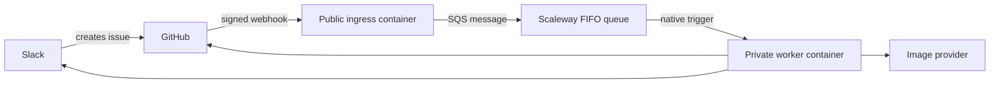

# Hosted webhook architecture

## Recommendation

Use **Scaleway Serverless Containers with Scaleway Queues** in an EU region.

Scaleway Containers scale to zero and accept OCI images. Scaleway Queues is an
in-house, managed implementation of the SQS protocol and does not depend on AWS
infrastructure. It provides Standard and FIFO queues, visibility timeouts,
message retention, explicit or content-based deduplication, and dead-letter
queues.

This repository uses the AWS JavaScript SQS client because that is the Node.js
client documented by Scaleway. It connects directly to Scaleway's endpoint with
Scaleway credentials; no AWS account or service is involved.

Sources:

- [Scaleway Queues FAQ](https://www.scaleway.com/en/docs/queues/faq/)
- [Using Node.js with Scaleway Queues](https://www.scaleway.com/en/docs/queues/api-cli/python-node-queues/)
- [Scaleway Queues concepts](https://www.scaleway.com/en/docs/queues/concepts/)
- [Deploying a Serverless Container](https://www.scaleway.com/en/docs/serverless-containers/how-to/deploy-container/)

## Target flow

The ingress validates the raw `X-Hub-Signature-256`, accepts only opened or
reopened issue events, publishes one message per `X-GitHub-Delivery`, and
returns `202`. The delivery ID is the FIFO message deduplication ID.

A native Scaleway queue trigger invokes the worker with the message in the
event body's `body` field. A response status of 300 or greater is retried up to
three times. Processing must finish before the worker responds.

Sources:

- [GitHub webhook best practices](https://docs.github.com/en/webhooks/using-webhooks/best-practices-for-using-webhooks)
- [Adding a trigger to a container](https://www.scaleway.com/en/docs/serverless-containers/how-to/add-trigger-to-a-container/)
- [Queue trigger retention](https://www.scaleway.com/en/docs/serverless-containers/reference-content/configure-trigger-inputs/)

## Current implementation

The repository contains the public ingress slice:

- `scripts/webhook-server.ts` exposes `/health` and `/webhooks/github`.
- `scripts/github-webhook.ts` validates and decodes GitHub deliveries.
- `scripts/scaleway-queue.ts` publishes deduplicated messages to a FIFO queue.
- `Dockerfile.webhook` builds the ingress container.

The private worker endpoint is not implemented yet. The existing GitHub Actions
workflow remains authoritative until the worker migration is complete. The
generation pipeline is host-independent: it publishes generated image bytes
through `MemePublisherService` and uses the existing `SagaService` and
`NotifierService` interfaces for the other durable effects. Their live CLI
layers retain the current filesystem, `git`, `gh`, and `curl` behavior.

A later slice can supply HTTP-backed publisher, saga, and notifier adapters and
expose the queue-triggered worker handler without changing generation
orchestration.

## Configuration

The ingress requires:

| Variable                | Purpose                                                          |
| ----------------------- | ---------------------------------------------------------------- |
| `GITHUB_WEBHOOK_SECRET` | Shared secret used to verify GitHub signatures                   |
| `SCW_SQS_ACCESS_KEY`    | Queue credential with publish permission                         |
| `SCW_SQS_SECRET_KEY`    | Secret for the queue credential                                  |
| `SCW_SQS_ENDPOINT`      | Regional endpoint, such as `https://sqs.mnq.fr-par.scaleway.com` |
| `SCW_SQS_QUEUE_URL`     | Full URL of the FIFO request queue                               |
| `SCW_SQS_REGION`        | Queue region, such as `fr-par`                                   |
| `PORT`                  | HTTP port; defaults to `8080`                                    |

Store the webhook and queue secrets as encrypted container secrets. Use
separate credentials for the ingress publisher and the worker trigger so each
has only the permissions it needs.

## Deployment outline

1. Create `meme-requests.fifo` and a same-region FIFO dead-letter queue.
2. Set the request queue visibility timeout above the worst-case generation
   time, retain messages for at least one day, and configure a maximum receive
   count before dead-lettering.
3. Create publish-only queue credentials for the ingress.
4. Build `Dockerfile.webhook`, push it to Scaleway Container Registry, and
   deploy it as a public Serverless Container with zero minimum instances.
5. Configure the ingress environment and encrypted secrets listed above.
6. Deploy the worker container privately with one replica and request
   concurrency of one initially.
7. Add a Scaleway Queues trigger for `meme-requests.fifo` using receive-only
   queue credentials.
8. Configure a GitHub webhook for issue events with JSON content and the same
   secret as `GITHUB_WEBHOOK_SECRET`.
9. Disable `.github/workflows/meme-on-issue.yml` only after an end-to-end
   delivery succeeds through the hosted worker.
