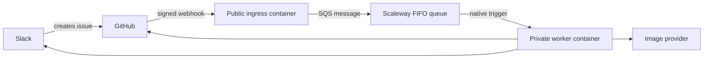

# Hosted webhook architecture

## Recommendation

Use **Scaleway Serverless Containers with Scaleway Queues** in an EU region.

Scaleway Containers scale to zero and accept OCI images. Scaleway Queues is an
in-house, managed implementation of the SQS protocol and does not depend on AWS
infrastructure. It provides Standard and FIFO queues, visibility timeouts,
message retention, explicit or content-based deduplication, and dead-letter
queues.

This repository uses the AWS JavaScript SQS client because that is the Node.js
client documented by Scaleway. It connects directly to Scaleway's endpoint with
Scaleway credentials; no AWS account or service is involved.

Sources:

- [Scaleway Queues FAQ](https://www.scaleway.com/en/docs/queues/faq/)
- [Using Node.js with Scaleway Queues](https://www.scaleway.com/en/docs/queues/api-cli/python-node-queues/)
- [Scaleway Queues concepts](https://www.scaleway.com/en/docs/queues/concepts/)
- [Deploying a Serverless Container](https://www.scaleway.com/en/docs/serverless-containers/how-to/deploy-container/)

## Target flow



The ingress validates the raw `X-Hub-Signature-256`, accepts only opened or
reopened issue events, publishes one message per `X-GitHub-Delivery`, and
returns `202`. The delivery ID is the FIFO message deduplication ID.

A native Scaleway queue trigger invokes the worker with the message in the
event body's `body` field. A response status of 300 or greater is retried up to
three times. Processing must finish before the worker responds.

Sources:

- [GitHub webhook best practices](https://docs.github.com/en/webhooks/using-webhooks/best-practices-for-using-webhooks)
- [Adding a trigger to a container](https://www.scaleway.com/en/docs/serverless-containers/how-to/add-trigger-to-a-container/)
- [Queue trigger retention](https://www.scaleway.com/en/docs/serverless-containers/reference-content/configure-trigger-inputs/)

## Current implementation

The repository contains the public ingress slice:

- `scripts/webhook-server.ts` exposes `/health` and `/webhooks/github`.
- `scripts/github-webhook.ts` validates and decodes GitHub deliveries.
- `scripts/scaleway-queue.ts` publishes deduplicated messages to a FIFO queue.
- `Dockerfile.webhook` builds the ingress container.

The repository also contains the queue worker slice:

- `scripts/worker-server.ts` accepts trigger requests at `POST /` and
  `POST /queue`, and exposes `GET /health`.
- `scripts/worker-transport.ts` tolerates either a direct JSON task or an event
  object whose `body` is the task object or its serialized JSON.
- `scripts/worker-server.ts` creates request-scoped configuration, while
  `scripts/hosted-worker.ts` orchestrates the existing provider, prompt,
  publisher, saga, and notifier interfaces in hosted-safe order.
- `scripts/hosted-github.ts` uses the Contents API for reads and the Git Data
  API for atomic writes, issue comments, and issue closure.
- `scripts/hosted-notifier.ts` posts the existing Slack payload contract with
  the Node HTTP client rather than shelling out to `curl`.
- `Dockerfile.worker` builds the dedicated production worker image.

Malformed envelopes, invalid task identities, and invalid Slack issue bodies
receive a terminal `200` response with `disposition: rejected`. Processing and
dependency failures receive `503`, causing the Scaleway trigger to retry.
Successful and resumed deliveries receive `200`. The CLI and GitHub Actions
layers are unchanged and retain their filesystem, `git`, `gh`, and `curl`
behavior.

### Atomic persistence and idempotency

The durable identity is the repository, issue number, and GitHub delivery ID.
The worker derives a stable meme UUID and marker path from that identity.

1. Before calling an image provider, reserve the delivery by committing
   `.github/meme-worker/deliveries/<sha256>.json`.
2. Read saga canon from the current target-branch head.
3. Create blobs for the image, optional updated saga, and completed marker.
4. Create one tree and one commit, then update the branch ref with
   `force: false`.
5. If the ref moved, re-read the marker and saga, re-derive the saga update, and
   retry. If another attempt completed the marker, use its result.
6. On redelivery, a completed marker skips provider generation, image commit,
   and saga application and resumes only incomplete notification work.

The image, saga, and completion marker are therefore atomic, and duplicate
successful deliveries do not generate another commit or apply a saga twice.
There are two unavoidable crash windows:

- A crash after a provider accepts the request but before GitHub records the
  completed result can cause another billed provider call. Neither the current
  providers nor Scaleway supply an end-to-end idempotency key.
- Slack incoming webhooks have no idempotency key or returned message ID. The
  worker claims the Slack send in the GitHub marker before posting, yielding
  at-most-once completion delivery. A crash after the claim and before Slack
  accepts the request can omit the Slack message, but will not duplicate it.

Issue completion comments include a hidden delivery marker. Retries find and
reuse that comment before closing the issue.

## Configuration

The ingress requires:

| Variable                | Purpose                                                          |
| ----------------------- | ---------------------------------------------------------------- |
| `GITHUB_WEBHOOK_SECRET` | Shared secret used to verify GitHub signatures                   |
| `SQS_ACCESS_KEY`        | Queue credential with publish permission                         |
| `SQS_SECRET_KEY`        | Secret for the queue credential                                  |
| `SQS_ENDPOINT`          | Regional endpoint, such as `https://sqs.mnq.fr-par.scaleway.com` |
| `SQS_QUEUE_URL`         | Full URL of the FIFO request queue                               |
| `SQS_REGION`            | Queue region, such as `fr-par`                                   |
| `PORT`                  | HTTP port; defaults to `8080`                                    |
| `HOSTED_INGRESS_MODE`   | `off`, exclusive `canary`, or `live`; defaults to `off`          |
| `HOSTED_CANARY_LABEL`   | Label admitted in canary mode; defaults to `hosted-canary`       |

Store the webhook and queue secrets as encrypted container secrets. Use
separate credentials for the ingress publisher and the worker trigger so each
has only the permissions it needs.

The worker requires:

| Variable                  | Purpose                                                    |
| ------------------------- | ---------------------------------------------------------- |
| `GITHUB_FINE_GRAINED_PAT` | Repository-scoped token for hosted persistence             |
| `SLACK_WEBHOOK_URL`       | Existing Slack Workflow incoming webhook                   |
| `OPENAI_API_KEY`          | Primary image generation and optional saga compression     |
| `XAI_API_KEY`             | Optional moderation fallback provider                      |
| `GITHUB_TARGET_BRANCH`    | Branch receiving output commits; defaults to `main`        |
| `GITHUB_API_URL`          | GitHub REST base URL; defaults to `https://api.github.com` |
| `PORT`                    | Worker HTTP port; defaults to `8080`                       |
| `GITHUB_REPOSITORY`       | Only repository the worker is allowed to mutate            |
| `WORKER_MODE`             | `diagnostic` or `live`; defaults to `diagnostic`            |
| `WORKER_DIAGNOSTIC_RESPONSE` | `success` (200) or `retry` (503) for trigger validation  |

For the first deployment, use a short-lived fine-grained PAT restricted to this
repository with **Contents: read and write** and **Issues: read and write**.
Store it only as an encrypted worker secret. A GitHub App can replace it later
if installation-token rotation and service attribution justify the additional
registration, private-key, JWT, and token-refresh machinery.

## Deployment outline

The repeatable deployment lives in `infra/scaleway`. Run
`infra/scaleway/setup.sh`; do not deploy directly from this outline.

1. Apply phase one with `deploy_containers=false`. OpenTofu creates the private
   registry, SQS service, FIFO request queue, same-region FIFO DLQ, scoped SQS
   credentials, and Containers namespace.
2. Build `Dockerfile.webhook` and `Dockerfile.worker`, tag both with an immutable
   commit identifier, and push them to the newly created registry.
3. Apply phase two with `deploy_containers=true`,
   `hosted_ingress_mode=off`, `worker_mode=diagnostic`, and
   `worker_trigger_enabled=false`. This is intentionally inert.
4. Manually create the GitHub webhook with JSON issue events and the same
   signing secret held by the ingress container.
5. Prove the trigger contract in diagnostic canary mode, then run an exclusive
   live canary.
6. Cut over with the state machine below. Keep the Actions workflow present;
   `MEME_PROCESSING_BACKEND` selects authority and an absent value means Actions.

Scaleway documents only that queue content appears in the event object's
`body` and responses of 300 or greater retry up to three times. It does not
document the method, default path, complete envelope, acknowledgement/deletion
timing, or private-container trigger compatibility. Layer 4 must run a
logging-only canary to verify the observed envelope, deliberate redelivery
after `500`, acknowledgement after `200`, and private-container compatibility
before the Actions cutover.

## OpenTofu resources and defaults

`infra/scaleway` uses `scaleway/scaleway ~> 2.82.0`, OpenTofu-compatible HCL,
and `fr-par`. It creates:

- one private Container Registry namespace and one Serverless Containers
  namespace;
- Scaleway SQS activation plus separate manage-only, publish-only,
  receive-only, and operations credentials;
- `memes-requests.fifo` and `memes-requests-dlq.fifo` in `fr-par`, with explicit
  deduplication IDs, one-day retention, 900-second visibility, long polling,
  and redrive after four receives;
- public ingress with zero minimum and two maximum instances, 30-second timeout,
  encrypted secrets, and `/health` liveness;
- a worker with zero minimum and one maximum instance, concurrency scaling
  threshold one, 840-second timeout, encrypted secrets, and `/health` liveness;
- an optional SQS trigger using receive-only credentials and `POST /queue`.

The 840-second worker timeout is below the 900-second visibility timeout.
Retention is at least one day so an outage is not silently converted into data
loss. FIFO permits one in-flight message per queue, so raising worker scale
before measuring throughput does not improve this design.

The provider cannot deploy an application image before it exists in the new
registry. The configuration therefore uses an explicit two-phase flow rather
than a placeholder image. `deploy_containers` and `worker_trigger_enabled` both
default to `false`.

OpenTofu state contains SQS credentials and values supplied to container
secrets. Local state and `.env.scaleway` are gitignored, but gitignore is not
encryption. Keep them mode `0600`, back them up only to an encrypted secret/state
store, and migrate to an encrypted remote backend before treating the
deployment as production. Never commit a plan file: saved plans contain secret
values.

Provider references:

- [Scaleway provider](https://registry.terraform.io/providers/scaleway/scaleway/latest/docs)
- [SQS queue resource](https://registry.terraform.io/providers/scaleway/scaleway/latest/docs/resources/mnq_sqs_queue)
- [Serverless Container resource](https://registry.terraform.io/providers/scaleway/scaleway/latest/docs/resources/container)
- [Container trigger resource](https://registry.terraform.io/providers/scaleway/scaleway/latest/docs/resources/container_trigger)

## Manual versus automated setup

The human must:

1. create/select the Scaleway project, enable billing and MFA, and create a
   deployment API key;
2. create a short-lived fine-grained PAT for only `henrikgrubbe/memes` with
   Contents and Issues read/write;
3. supply the Slack, OpenAI, optional xAI, and webhook-signing secrets;
4. approve each plan/apply, authenticate Docker, build and push the two images;
5. create the GitHub webhook, run every canary observation, pause/resume the
   upstream Slack intake, and approve cutover.

OpenTofu creates all registry, queue, scoped queue credential, container,
encrypted secret wiring, probe, scaling, and optional trigger resources. It
does not create a Scaleway account, billing method, MFA, GitHub PAT, provider
API keys, Slack/OpenAI credentials, GitHub webhook, GitHub repository variable,
or remote state backend.

The wizard stores captured values only in ignored `.env.scaleway` with a
restrictive umask. It never writes secrets to tracked HCL or GitHub Actions.
Run it from the repository root:

```bash
./infra/scaleway/setup.sh
```

The wizard links official pages rather than relying on unstable Scaleway
console click paths. It can resume an interrupted setup while Actions remains
authoritative. Once `MEME_PROCESSING_BACKEND=hosted`, it refuses a full rerun
rather than risking container destruction; use the rotation or rollback
procedure below.

## Exclusive canary and cutover state machine

| State | GitHub variable | Ingress | Worker | Trigger | Authority |
| --- | --- | --- | --- | --- | --- |
| Default | absent or `actions` | `off` | `diagnostic` | absent | Actions |
| Diagnostic canary | Actions | `canary` | `diagnostic` | enabled | Actions, except labelled canary |
| Live canary | Actions | `canary` | `live` | enabled | Actions, except labelled canary |
| Buffering cutover | `hosted` | `live` | `diagnostic` | absent | Queue buffers |
| Hosted live | `hosted` | `live` | `live` | enabled | Hosted worker |
| Rolled back | `actions` | `off` | `diagnostic` | absent | Actions |

The workflow skips an issue only when `MEME_PROCESSING_BACKEND=hosted` or the
issue already has the `hosted-canary` label in its `opened`/`reopened` event.
Canary ingress admits only that label. Always attach the label before creating
the canary issue; adding it later does not replay the opening event. Each
diagnostic and live canary uses a new issue/delivery, so no request can be
processed by both backends.

OpenTofu also rejects `live` ingress with an attached diagnostic trigger:
successful diagnostics return 200 and would otherwise acknowledge real
requests without processing them. Authority transfer in the wizard is fatal
and read-after-write verified before live ingress can be applied. If the live
ingress apply is declined, interrupted, or fails, the wizard restores Actions
authority and keeps intake paused. It requires zero visible and zero in-flight
request messages before switching a diagnostic worker to live mode, since a
503 diagnostic may remain hidden for the full visibility timeout.

For live cutover:

1. Pause Slack issue creation and wait for Actions and the queue to drain.
2. Detach the trigger while ingress remains canary-only.
3. Set `MEME_PROCESSING_BACKEND=hosted`; Actions now skips new requests.
4. Apply `hosted_ingress_mode=live` while the trigger is absent. New deliveries
   buffer durably.
5. Apply `worker_mode=live` and `worker_trigger_enabled=true`.
6. Resume Slack intake and observe the first request end to end.

Pausing intake closes the small control-plane gap between steps 3 and 4. If an
issue is created in that gap, use GitHub's webhook redelivery after ingress is
live. Do not use the same issue as an Actions retry.

## Mandatory live canary observations

Scaleway documents only that message content is in event `body` and that an HTTP
status of 300 or greater is retried up to three times. Before private or live
processing, record evidence for all of the following:

1. The configured `POST /queue` request reaches a private worker.
2. The actual content type and envelope decode without logging the issue body.
3. Diagnostic `503` produces the observed retry count and delay.
4. Diagnostic `200` stops redelivery and the message disappears from the source
   queue.
5. Repeated failures interact with `max_receive_count=4` as expected and land in
   the DLQ.
6. A new exclusive live canary produces exactly one provider request, output
   commit, issue completion, and Slack completion.
7. Registry, Queues, and Serverless Containers all create successfully in
   `fr-par`; Scaleway's current product-availability table is client-rendered
   and was not statically verifiable.

The full envelope, acknowledgement/deletion timing, retry delay, visibility
extension behavior, DLQ interaction, and private-container trigger
compatibility are not documented guarantees. If private invocation fails,
stop. A temporary public diagnostic worker can isolate privacy as the cause,
but public live processing needs a separate authenticated design and is not an
automatic fallback.

## Monitoring and operations

- Probe public ingress with `curl -fsS "$INGRESS_ENDPOINT/health"`. Treat a
  non-200 response, SQS publish 5xx, or GitHub webhook delivery failure as
  paging signals.
- Use Scaleway Serverless Container logs for start/failure/status diagnostics
  and queue metrics/attributes for visible, in-flight, and DLQ message counts.
  Alert on any DLQ message, oldest-message age approaching retention, repeated
  worker 503s, and sustained max-scale execution.
- Scaleway documents Cockpit integration with 31 days of included metrics and
  seven days of included logs/traces. Set explicit longer retention only after
  reviewing its cost.
- Application logs contain repository, issue number, delivery ID, disposition,
  provider status, and retry timing. They must not print webhook/PAT/provider
  secrets, queue message bodies, issue bodies, prompts, or Slack webhook URLs.
  Diagnostic mode explicitly logs `body omitted`.
- Check `ApproximateNumberOfMessages`,
  `ApproximateNumberOfMessagesNotVisible`, and
  `ApproximateAgeOfOldestMessage` before and after every transition. Queue
  attributes are eventually consistent; use repeated observations.

For DLQ inspection, obtain the sensitive operations credentials only in the
current shell:

```bash
cd infra/scaleway
export AWS_ACCESS_KEY_ID="$(tofu output -raw operations_sqs_access_key)"
export AWS_SECRET_ACCESS_KEY="$(tofu output -raw operations_sqs_secret_key)"
export AWS_DEFAULT_REGION=fr-par
endpoint="$(tofu output -raw sqs_endpoint)"
dlq="$(tofu output -raw dead_letter_queue_url)"
request_queue="$(tofu output -raw request_queue_url)"
tmp="$(mktemp)"
chmod 600 "$tmp"
aws --endpoint-url "$endpoint" sqs receive-message \
  --queue-url "$dlq" --max-number-of-messages 1 \
  --visibility-timeout 0 --attribute-names All >"$tmp"
```

The temporary file contains the original issue body. Inspect it only on a
trusted machine and delete it when done. To replay, receive one message with a
300-second visibility timeout, confirm its repository/issue/delivery identity,
send its body to `request_queue` with group ID `meme-requests` and a new replay
deduplication ID, then delete the DLQ receipt only after `send-message`
succeeds. Never bulk replay: the durable GitHub marker makes completed
deliveries resumable, but unresolved failures can still repeat billed provider
calls. Use the official [Scaleway SQS
endpoint](https://www.scaleway.com/en/docs/queues/api-cli/aws-cli/) instructions.

## Rotation, rollback, and cost

Rotate the GitHub PAT before its recorded expiry: create the replacement with
the same narrow repository permissions, update
`TF_VAR_github_fine_grained_pat`, apply, run an exclusive canary, then revoke
the old token. Use the same replace-apply-canary-revoke sequence for Slack and
provider secrets. Rotate queue credentials by replacing their OpenTofu
resources during paused intake; never delete the credential currently used by
an attached trigger.

Rollback is deliberately asymmetric:

1. Pause intake.
2. Apply trigger absent, ingress off, and worker diagnostic.
3. Set `MEME_PROCESSING_BACKEND=actions` (or delete the variable).
4. Decide each buffered request's owner before resuming. Either leave it queued
   for a hosted recovery, or delete it from the queue and reopen/re-dispatch the
   issue to Actions. Never do both.
5. Resume intake.

Do not delete the workflow; the CLI/manual Actions path remains the fallback.
Do not purge a queue without a separate human confirmation and a saved list of
delivery IDs.

Cost guardrails are zero minimum instances, worker maximum scale one, ingress
maximum scale two, FIFO serialization, one-day default retention, and explicit
immutable image tags. Also configure Scaleway billing alerts, review provider
usage after the first live request, prune old registry tags, cap log retention,
and leave the trigger absent when hosted processing is not authoritative.
