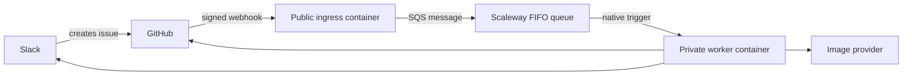

# Hosted webhook architecture

## Recommendation

Use **Scaleway Serverless Containers with Scaleway Queues** in an EU region.

Scaleway Containers scale to zero and accept OCI images. Scaleway Queues is an
in-house, managed implementation of the SQS protocol and does not depend on AWS
infrastructure. It provides Standard and FIFO queues, visibility timeouts,
message retention, explicit or content-based deduplication, and dead-letter
queues.

This repository uses the AWS JavaScript SQS client because that is the Node.js
client documented by Scaleway. It connects directly to Scaleway's endpoint with
Scaleway credentials; no AWS account or service is involved.

Sources:

- [Scaleway Queues FAQ](https://www.scaleway.com/en/docs/queues/faq/)
- [Using Node.js with Scaleway Queues](https://www.scaleway.com/en/docs/queues/api-cli/python-node-queues/)
- [Scaleway Queues concepts](https://www.scaleway.com/en/docs/queues/concepts/)
- [Deploying a Serverless Container](https://www.scaleway.com/en/docs/serverless-containers/how-to/deploy-container/)

## Target flow

The ingress validates the raw `X-Hub-Signature-256`, accepts only opened or
reopened issue events, publishes one message per `X-GitHub-Delivery`, and
returns `202`. The delivery ID is the FIFO message deduplication ID.

A native Scaleway queue trigger invokes the worker with the message in the
event body's `body` field. A response status of 300 or greater is retried up to
three times. Processing must finish before the worker responds.

Sources:

- [GitHub webhook best practices](https://docs.github.com/en/webhooks/using-webhooks/best-practices-for-using-webhooks)
- [Adding a trigger to a container](https://www.scaleway.com/en/docs/serverless-containers/how-to/add-trigger-to-a-container/)
- [Queue trigger retention](https://www.scaleway.com/en/docs/serverless-containers/reference-content/configure-trigger-inputs/)

## Current implementation

The repository contains the public ingress slice:

- `scripts/webhook-server.ts` exposes `/health` and `/webhooks/github`.
- `scripts/github-webhook.ts` validates and decodes GitHub deliveries.
- `scripts/scaleway-queue.ts` publishes deduplicated messages to a FIFO queue.
- `Dockerfile.webhook` builds the ingress container.

The repository also contains the queue worker slice:

- `scripts/worker-server.ts` accepts trigger requests at `POST /` and
  `POST /queue`, and exposes `GET /health`.
- `scripts/worker-transport.ts` tolerates either a direct JSON task or an event
  object whose `body` is the task object or its serialized JSON.
- `scripts/worker-server.ts` creates request-scoped configuration, while
  `scripts/hosted-worker.ts` orchestrates the existing provider, prompt,
  publisher, saga, and notifier interfaces in hosted-safe order.
- `scripts/hosted-github.ts` uses the Contents API for reads and the Git Data
  API for atomic writes, issue comments, and issue closure.
- `scripts/hosted-notifier.ts` posts the existing Slack payload contract with
  the Node HTTP client rather than shelling out to `curl`.
- `Dockerfile.worker` builds the dedicated production worker image.

Malformed envelopes, invalid task identities, and invalid Slack issue bodies
receive a terminal `200` response with `disposition: rejected`. Processing and
dependency failures receive `503`, causing the Scaleway trigger to retry.
Successful and resumed deliveries receive `200`. The CLI and GitHub Actions
layers are unchanged and retain their filesystem, `git`, `gh`, and `curl`
behavior.

### Atomic persistence and idempotency

The durable identity is the repository, issue number, and GitHub delivery ID.
The worker derives a stable meme UUID and marker path from that identity.

1. Before calling an image provider, reserve the delivery by committing
   `.github/meme-worker/deliveries/<sha256>.json`.
2. Read saga canon from the current target-branch head.
3. Create blobs for the image, optional updated saga, and completed marker.
4. Create one tree and one commit, then update the branch ref with
   `force: false`.
5. If the ref moved, re-read the marker and saga, re-derive the saga update, and
   retry. If another attempt completed the marker, use its result.
6. On redelivery, a completed marker skips provider generation, image commit,
   and saga application and resumes only incomplete notification work.

The image, saga, and completion marker are therefore atomic, and duplicate
successful deliveries do not generate another commit or apply a saga twice.
There are two unavoidable crash windows:

- A crash after a provider accepts the request but before GitHub records the
  completed result can cause another billed provider call. Neither the current
  providers nor Scaleway supply an end-to-end idempotency key.
- Slack incoming webhooks have no idempotency key or returned message ID. The
  worker claims the Slack send in the GitHub marker before posting, yielding
  at-most-once completion delivery. A crash after the claim and before Slack
  accepts the request can omit the Slack message, but will not duplicate it.

Issue completion comments include a hidden delivery marker. Retries find and
reuse that comment before closing the issue.

## Configuration

The ingress requires:

| Variable                | Purpose                                                          |
| ----------------------- | ---------------------------------------------------------------- |
| `GITHUB_WEBHOOK_SECRET` | Shared secret used to verify GitHub signatures                   |
| `SCW_SQS_ACCESS_KEY`    | Queue credential with publish permission                         |
| `SCW_SQS_SECRET_KEY`    | Secret for the queue credential                                  |
| `SCW_SQS_ENDPOINT`      | Regional endpoint, such as `https://sqs.mnq.fr-par.scaleway.com` |
| `SCW_SQS_QUEUE_URL`     | Full URL of the FIFO request queue                               |
| `SCW_SQS_REGION`        | Queue region, such as `fr-par`                                   |
| `PORT`                  | HTTP port; defaults to `8080`                                    |

Store the webhook and queue secrets as encrypted container secrets. Use
separate credentials for the ingress publisher and the worker trigger so each
has only the permissions it needs.

The worker requires:

| Variable                  | Purpose                                                    |
| ------------------------- | ---------------------------------------------------------- |
| `GITHUB_FINE_GRAINED_PAT` | Repository-scoped token for hosted persistence             |
| `SLACK_WEBHOOK_URL`       | Existing Slack Workflow incoming webhook                   |
| `OPENAI_API_KEY`          | Primary image generation and optional saga compression     |
| `XAI_API_KEY`             | Optional moderation fallback provider                      |
| `GITHUB_TARGET_BRANCH`    | Branch receiving output commits; defaults to `main`        |
| `GITHUB_API_URL`          | GitHub REST base URL; defaults to `https://api.github.com` |
| `PORT`                    | Worker HTTP port; defaults to `8080`                       |

For the first deployment, use a short-lived fine-grained PAT restricted to this
repository with **Contents: read and write** and **Issues: read and write**.
Store it only as an encrypted worker secret. A GitHub App can replace it later
if installation-token rotation and service attribution justify the additional
registration, private-key, JWT, and token-refresh machinery.

## Deployment outline

1. Create `meme-requests.fifo` and a same-region FIFO dead-letter queue.
2. Set the request queue visibility timeout above the worst-case generation
   time, retain messages for at least one day, and configure a maximum receive
   count before dead-lettering.
3. Create publish-only queue credentials for the ingress.
4. Build `Dockerfile.webhook`, push it to Scaleway Container Registry, and
   deploy it as a public Serverless Container with zero minimum instances.
5. Configure the ingress environment and encrypted secrets listed above.
6. Build `Dockerfile.worker` and deploy it with request concurrency one and
   maximum scale one initially; a FIFO queue permits one in-flight message.
7. Add a Scaleway Queues trigger for `meme-requests.fifo` using receive-only
   queue credentials.
8. Configure a GitHub webhook for issue events with JSON content and the same
   secret as `GITHUB_WEBHOOK_SECRET`.
9. Disable `.github/workflows/meme-on-issue.yml` only after an end-to-end
   delivery succeeds through the hosted worker.

Scaleway documents only that queue content appears in the event object's
`body` and responses of 300 or greater retry up to three times. It does not
document the method, default path, complete envelope, acknowledgement/deletion
timing, or private-container trigger compatibility. Layer 4 must run a
logging-only canary to verify the observed envelope, deliberate redelivery
after `500`, acknowledgement after `200`, and private-container compatibility
before the Actions cutover.
